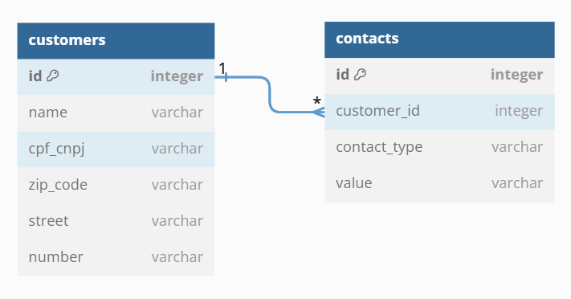

# API de Cadastro de Clientes em Ruby on Rails

Decidi enfrentar o desafio de desenvolver uma API utilizando uma linguagem com a qual nunca havia trabalhado antes, o Ruby. Para isso, escolhi um dos frameworks mais populares dentro do ecossistema da linguagem, o Ruby on Rails. Abaixo estão os detalhes do projeto.

## Modelagem da Solução

Para iniciar o projeto, comecei modelando as tabelas que seriam utilizadas no site [dbdiagram.io](https://dbdiagram.io). Optei por incluir os dados do endereço na mesma tabela de usuários, pois a quantidade de informações era pequena. No entanto, caso mais detalhes fossem necessários, seria recomendável criar uma tabela separada para armazenar as informações de endereço dos usuários.

  

Após seguir a documentação oficial, realizei a instalação do framework. Para iniciar o projeto, optei por utilizar a combinação de comandos `--api` para configurar o aplicativo apenas para API, e `--database=DATABASE` para pré-configurar automaticamente o banco de dados que eu gostaria de utilizar, neste caso, PostgreSQL (o banco de dados escolhido deve estar previamente instalado no ambiente de desenvolvimento).

## Rotas

### Usuários (Customers)

- `GET /customers` (retorna todos os usuários cadastrados)
- `GET /customers/id` (retorna o usuário pelo id)
- `GET /customers/id/contacts` (retorna apenas os contatos do usuário informado pelo id)
- `POST /customers` (cria um novo usuário)
- `PUT /customers/id` (atualiza um usuário existente pelo id)
- `DELETE /customers/id` (deleta um usuário pelo id; ao deletar um usuário, todos os contatos relacionados a ele são deletados automaticamente)

### Contatos (Contacts)

- `GET /contacts` (retorna todos os contatos cadastrados)
- `GET /contacts/id` (retorna o contato pelo id)
- `POST /contacts` (cria um novo contato)
- `PUT /contacts/id` (atualiza um contato existente pelo id)
- `DELETE /contacts/id` (deleta um contato pelo id)

## Rodando Localmente

#### Necessário

- [Ruby](https://www.ruby-lang.org/pt/downloads/)
- [Ruby on Rails](https://guides.rubyonrails.org/getting_started.html)
- [PostgresSQL](https://www.postgresql.org/download/)

#### Rodando

1. Clone o projeto

- `git clone https://github.com/pedropaulovtz/customers-tiflux.git`

2. Já dentro da pasta do projeto, instale as dependências:

- `bundle install`

3. Configurando banco de dados:

    Lembre-se de configurar o `user` e `password` do banco de dados PostgreSQL configurado localmente na pasta `database.yml` dentro da pasta `config` do projeto.

- `rails db:create`
- `rails db:migrate`
- `rails db:seed # Se houver dados iniciais para carregar`

4. Iniciando servidor:

- `rails server`

5. Acessando o projeto:

-  `http://localhost:3000`

## Considerações Finais

Desenvolver este desafio utilizando Ruby como linguagem foi uma experiência surpreendente. Embora não tivesse muita familiaridade com o desenvolvimento backend, gostei muito da sintaxe da linguagem e, especialmente, do framework Ruby on Rails, que facilitou significativamente o desenvolvimento do projeto.
